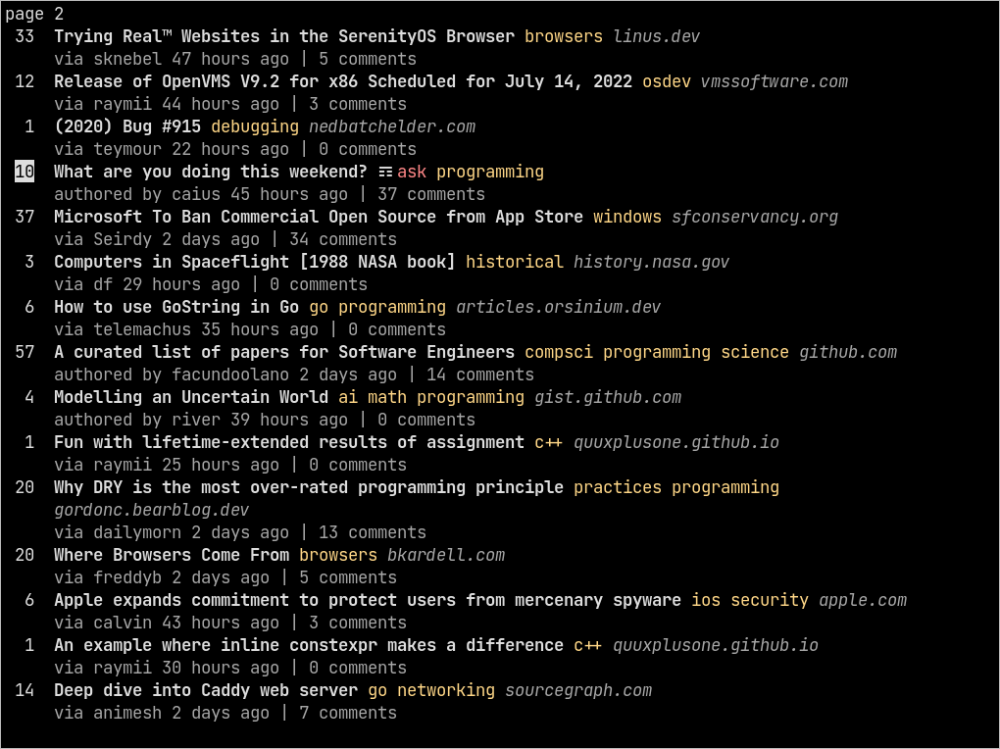

# Kreeftje 🦞

This is a little terminal reader for [lobste.rs](https://lobste.rs/). I love reading the site, so I made a little terminal user interface for it. This is not finished, but that does not matter.



## Installation

```zsh
git clone https://github.com/koenwestendorp/kreeftje
cd kreeftje
cargo install --path .
```

## Usage

_(Given that your `~/.cargo/bin/` is in your `$PATH`.)_

```zsh
kreeftje
```

Otherwise, running from the source directory would suffice too, of course.

```zsh
cargo run --release
```

### Key bindings

Within the program, the following key bindings can be used for navigation.

&larr;, &rarr;, `h`, `l`
: Move between the stories list and comments view.

&darr;, &uarr;, `j`, `k`
: Select next and previous stories in the stories list page. 
Move up and down in the comments view.

`J`, `K`
: Move to the next and previous page when in the stories list. 
Move to the next and previous story when in the comments view.

`g`, `G`
: Move to the top and bottom of the stories list or comments view.

`o`, `Enter`
: Open the selected story in the browser.

(That browser will be the default browser for your system, and respects your `$BROWSER` environment variable. For further information, see the documentation of the [webbrowser](https://docs.rs/webbrowser/latest/webbrowser/) crate that is used under the hood.)

`q`, `<ctrl-C>`
: Quit the program.

## The name

The name 'kreeftje' is dutch for little lobster. Because my program is like a tiny version of the actual site, I think the name is cute and appropriate &lt;3.

## Things I might implement

- [x] Ability to read comments associated with the stories. Comments can be accessed through a rightward motion (&rarr; or `l`), and navigated in a separate view.
- [x] Tag coloring, just like on the site.
- [ ] Command line arguments to specify preferences.
- [ ] Config file abilities.
- [ ] Clear help and info.
- [ ] A way of 'selecting' stories, say by hitting the space bar, and then applying operations on them. Such operations could include saving stories, or opening them by bulk in the browser.
- [ ] API, rather than scraping the site??
